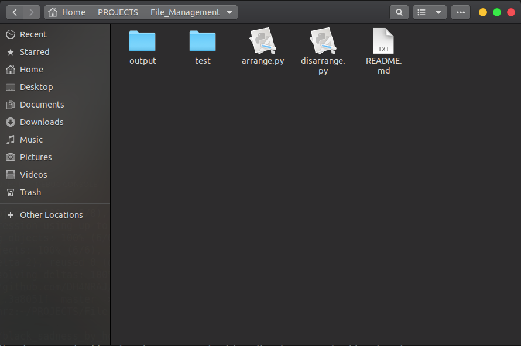
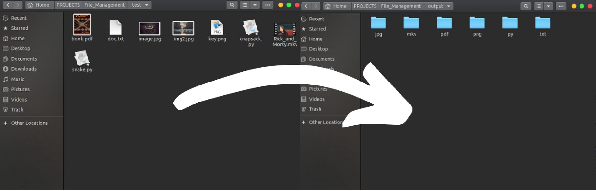
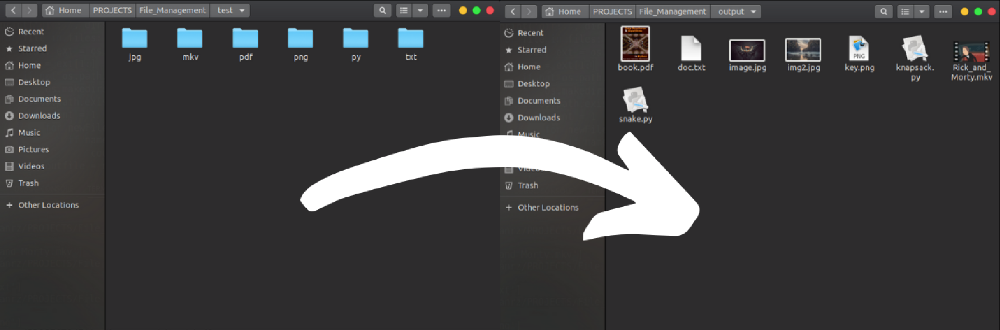

# File Management

Simple Python script to arrange and disarrange files

## Prerequisites

```
python 3.8.2
```



### Arranging Files

Make sure that the python script, test and output are under same directory. 

```
$python arrange.py test
```
run this command to arrange the files.  
test - directory which has all the files.  
ouput - files are copied and arranged in this directory.





### Disarranging Files


Make sure that the python script, test and output are under same directory. 

```
$python disarrange.py test output
```
run this command to arrange the files.  
test - directory which has all the files.  
ouput - files are copied and disarranged in this directory.




## Authors

  [Dhanraj K](https://github.com/DH4NRAJ)
